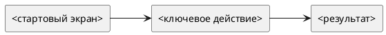

# Требования по функциональности — <Русское название> (<feature-slug>)

Статус: **черновик**
Редакция: `<1>`
Профиль требований: **АС КОДА / ISO/IEC/IEEE 29148:2018**
Утвердил: `<заполняется только пользователем при утверждении>`
Дата утверждения: `<YYYY-MM-DD или не утверждено>`
Функциональность: `features/<feature-slug>/feature.md`
Квартал: `<YYYY-QN>`
Дата обновления: `<YYYY-MM-DD>`
Формат: **новый лёгкий**
Шаблон: `templates/requirements/feature-requirements.readable.template.md`

## Как читать документ

- Этот файл — главный источник бизнес-правил, спорных решений и общей логики функциональности.
- Срезы ниже до передачи являются разделами этого документа, а не отдельными файлами.
- Карточки срезов и подробные требования клиентской и серверной частей будут построены из этого файла только при явной подготовке пакета.
- Диаграммы пишем только в PlantUML.

## Оглавление

1. Назначение и границы
2. Текущее состояние
3. Участники и внешние системы
4. Термины и данные
5. Функциональные требования
6. Сценарии
7. Нефункциональные требования
8. Порядок и контроль срезов
9. Системные правила и интеграции
10. Доработки затронутых функциональностей
11. Зависимости и предположения
12. Критерии завершённости
13. Трассировка
14. Открытые вопросы

## Назначение и границы

- Назначение:
- Требуемый пользовательский или системный результат:
- Входит в объём:
- Не входит в объём:
- Источники:

## Текущее состояние

- Подтверждённое поведение из `baseline/current/`:
- Проверяемые предположения о текущей реализации:
- Известные ограничения:

## Участники и внешние системы

| Участник или система | Роль в процессе | Ответственность или граница |
|---|---|---|
| `<роль или система>` |  |  |

## Быстрая схема



## Порядок срезов

1. `01 <slice-slug>` — <Русское название среза>
2. `02 <slice-slug>` — <Русское название среза>
3. `03 <slice-slug>` — <Русское название среза>

---

## Термины и данные

### Термины

| Термин | Смысл | Важные ограничения |
|---|---|---|
| `<термин>` |  |  |

### Данные

| Объект или таблица | Поле | Смысл | Источник | Ограничения |
|---|---|---|---|---|
|  |  |  |  |  |

### Роли и доступность

| Роль | Просмотр | Создание/редактирование | Действия | Ограничения |
|---|---|---|---|---|
| `<роль>` |  |  |  |  |

## Функциональные требования

| Идентификатор | Нормативное требование | Обоснование | Источник | Приоритет | Проверка |
|---|---|---|---|---|---|
| REQ-<FEATURE>-001 | Система должна `<наблюдаемый результат>`. |  |  | обязательный | TEST-<ID> |

## Сценарии

| Идентификатор | Начальные условия | Действие или событие | Ожидаемый результат | Ошибки и границы | Требования |
|---|---|---|---|---|---|
| SCN-<FEATURE>-001 |  |  |  |  | REQ-<FEATURE>-001 |

## Нефункциональные требования

| Идентификатор | Направление | Нормативное требование или причина неприменимости | Источник | Приоритет | Проверка |
|---|---|---|---|---|---|
| REQ-<FEATURE>-NFR-001 или `неприменимо` | Производительность и объём |  |  |  |  |
| REQ-<FEATURE>-NFR-002 или `неприменимо` | Надёжность и повторный запуск |  |  |  |  |
| REQ-<FEATURE>-NFR-003 или `неприменимо` | Безопасность и доступ |  |  |  |  |
| REQ-<FEATURE>-NFR-004 или `неприменимо` | Наблюдаемость и аудит |  |  |  |  |
| REQ-<FEATURE>-NFR-005 или `неприменимо` | Совместимость и миграция |  |  |  |  |
| REQ-<FEATURE>-NFR-006 или `неприменимо` | Доступность интерфейса |  |  |  |  |

## Системные правила и интеграции

### Статусы и переходы

```plantuml
@startuml
[*] --> <STATUS_1>
<STATUS_1> --> <STATUS_2> : <action>
<STATUS_2> --> [*]
@enduml
```

| Текущий статус | Действие | Новый статус | Что проверить |
|---|---|---|---|
| `<STATUS_1>` | `<action>` | `<STATUS_2>` |  |

### API

| Метод | Маршрут | Назначение |
|---|---|---|
| `<METHOD>` | `<path>` |  |

### Модель данных

| Сущность / таблица | Поле | Тип | Обяз. | Комментарий |
|---|---|---|---:|---|
|  |  |  |  |  |

---

## Контроль срезов

## <STORY/Jira/feature-slice-id> — <Русское название среза>

Карточка среза после подготовки пакета: `slices/<slice-slug>/slice.md`
Детализация клиентской части после подготовки пакета: `slices/<slice-slug>/requirements/frontend.md`
Детализация серверной части после подготовки пакета: `slices/<slice-slug>/requirements/backend.md`
Плановая история: `planning/stories/STORY-<FEATURE>-NNN.md`

**Назначение**

- 

**Критерии приемки**

| Идентификатор критерия | Критерий |
|---|---|
| AC-<FEATURE>-<SLICE>-001 |  |

**Что проверить тестировщику**

- [ ]
- [ ]
- [ ]

---

## Общий чеклист для тестирования

| Проверка | Где детализировано |
|---|---|
|  | `будет сформировано при подготовке пакета` |

## Доработки затронутых функциональностей

Все обязательные изменения соседних функциональностей входят в объём работ и верхнеуровневую оценку текущей функциональности.

| Идентификатор влияния | Затронутая функциональность | Причина | Требуемая доработка | Срез/компонент | Влияние на FE/BE/QA | Критерий завершения | Покрытие требованиями, планом и проверками | Статус синхронизации |
|---|---|---|---|---|---|---|---|---|
| IMP-<FEATURE>-001 |  |  |  |  |  | AC-<ID> | STORY-/CAND-/TEST- | ожидает решения |

## Зависимости и предположения

| Идентификатор | Тип | Описание | Что блокирует | Способ проверки | Состояние |
|---|---|---|---|---|---|
| DEP-<FEATURE>-001 | зависимость / предположение |  |  |  | открыто |

## Критерии завершённости

- [ ] Все обязательные `REQ-*` подтверждены проверками.
- [ ] Все `SCN-*` пройдены либо имеют согласованное решение.
- [ ] Обязательные влияния на соседние функциональности выполнены.
- [ ] Устаревшие правила и производные материалы подчищены.
- [ ] Получены необходимые доказательства реализации и проверки.

## Трассировка

| Идентификатор | Источник или решение | Срез | Карточка разработки | Проверка | Редакция пакета | Квитанция |
|---|---|---|---|---|---|---|
| REQ-<FEATURE>-001 |  |  | не сформирована | TEST-<ID> | не сформирована | не получена |
| REQ-<FEATURE>-NFR-001 |  |  | не сформирована | TEST-<ID> | не сформирована | не получена |
| SCN-<FEATURE>-001 |  |  | не сформирована | TEST-<ID> | не сформирована | не получена |

## Открытые вопросы

- `<вопрос либо «нет»>`

## Правила формата

- Бизнес-контекст, длинные объяснения и спорные решения держим здесь.
- Срезы должны быть короткими, наглядными и исчерпывающими только в рамках своего среза.
- В каждом срезе должна быть информация для тестировщика.
- Для каждого обязательного влияния на соседнюю функциональность должна существовать строка в разделе `Доработки затронутых функциональностей`.
- Каждое нормативное правило получает устойчивый `REQ-*`, явную проверку и строку в матрице трассировки.
- Каждый сценарий получает `SCN-*` и ссылается только на правила из этого документа.
- Старый вариант требований не смешиваем с новым: если выбран этот шаблон, все карточки срезов и пакеты требований FE/BE ведём в новом лёгком стиле.
