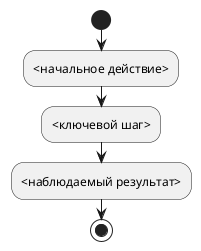

# Требования по функциональности — <Русское название>

Статус: **черновик**
Редакция: `<1>`
Формат: **последовательный человекочитаемый**
Функциональность: `<feature-slug>`
Квартал: `<YYYY-QN>`
Дата обновления: `<YYYY-MM-DD>`

## Кратко о функциональности

<Два-три абзаца: какую проблему решаем, для кого и какой законченный результат должен появиться.>

## Цель и ожидаемый результат

- Цель:
- Пользовательский или системный результат:
- Как поймём, что результат достигнут:

## Границы

### Входит в объём

-

### Не входит в объём

-

### Источники и принятые решения

-

## Текущее и требуемое состояние

### Сейчас

<Подтверждённое поведение, ограничения и отдельно отмеченные предположения.>

### После изменения

<Целевое поведение без описания предполагаемого способа написания кода.>

## Участники, внешние системы и данные

| Участник, система или объект | Роль в процессе | Ответственность или источник данных |
|---|---|---|
| `<роль или система>` |  |  |

## Общая схема процесса

Диаграмма поясняет текст и не вводит самостоятельных требований.

## <01. Первая функциональная глава в порядке процесса>

### Результат

<Законченный результат этого участка процесса.>

### Участники и начальные условия

-

### Основной ход

1.
2.
3.

### Правила

**REQ-<FEATURE>-001. <Короткий человекочитаемый заголовок>**

Система должна `<один наблюдаемый результат>`.

Источник: `<решение, документ или правило>`.
Приоритет: **обязательный**.

### Исключения и ошибки

**REQ-<FEATURE>-002. <Короткий заголовок пограничного правила>**

Если `<условие>`, система должна `<наблюдаемый результат>`.

### Примеры приёмки

**AC-<FEATURE>-001. <Короткий заголовок>**

- Дано: `<начальные условия>`.
- Когда: `<действие или событие>`.
- Тогда: `<наблюдаемый результат>`.
- Требования: `REQ-<FEATURE>-001`, `REQ-<FEATURE>-002`.

### Влияния

- `<нет либо ссылка на IMP-*>`.

## <02. Следующая функциональная глава>

<Повтори порядок: результат, условия, основной ход, правила, исключения, примеры, влияния.>

## Общие правила

<Только правила, действительно общие для нескольких глав. Каждое получает отдельный REQ-* и человекочитаемый заголовок.>

## Ошибки и пограничные случаи

<Сводно перечисли общесистемные ошибки, повторный запуск, конфликты, параллельность и восстановление, если они не относятся к одной главе.>

## Нефункциональные требования

<Добавь только применимые измеримые требования: производительность, надёжность, безопасность, наблюдаемость, совместимость, доступность. Неприменимые направления перечислять не нужно.>

## Доработки затронутых функциональностей

| Идентификатор | Функциональность | Причина | Требуемая доработка | Связанные требования | Критерий завершения |
|---|---|---|---|---|---|
| IMP-<FEATURE>-001 |  |  |  | REQ-<FEATURE>-001 | AC-<FEATURE>-001 |

## Подчистка устаревшего поведения

| Что устаревает | Где находится | Требуемое действие | Связанное требование или причина сохранения |
|---|---|---|---|
| `<поле, статус, маршрут, подпись, проверка или документ>` |  | удалить / заменить / оставить |  |

## Сводная трассировка

| Требование | Источник | Примеры приёмки | Задачи разработки | Результат реализации |
|---|---|---|---|---|
| REQ-<FEATURE>-001 |  | AC-<FEATURE>-001 | задача не получена | результат не получен |

## Открытые вопросы

- `<нет либо один однозначно сформулированный вопрос>`.

## Правила ведения документа

- Это единственный авторский документ требований функциональности.
- Требования излагаются по ходу пользовательского или системного процесса.
- Каждое нормативное правило получает устойчивый `REQ-*` и отдельный абзац.
- Примеры приёмки не создают правил, отсутствующих в `REQ-*`.
- Диаграммы оформляются только встроенными блоками PlantUML.
- Отдельные срезы и пакеты требований по контурам не формируются.
