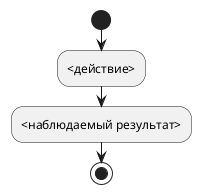

# <Русское название функциональности>

Редакция: `<1>`
Формат: **компактная спецификация функциональности**
Функциональность: `<feature-slug>`

## Назначение

<Два-три связных абзаца: какую проблему решаем, для кого, почему изменение нужно и
какой законченный результат должен появиться. Не описывать предполагаемый способ
написания кода.>

## Границы

Этап поставки: stage-1
Название этапа: <дословное однострочное title из реестра этапов>
Цель этапа: <дословное однострочное goal из реестра этапов>

В объём входит:

- <результат или изменение>.

В объём не входит:

- <явно исключённая часть; ссылка на предварительный бэклог или архив с причиной,
  без обещания исполнения>.

<Для следующего этапа: использовать утверждённый stage_id, название и цель;
назвать подтверждённые зависимости от предыдущего результата. Прежнее внедрённое
поведение сохраняется, если его изменение или удаление явно не входит в этот этап.
Не включать остаток автоматически и не создавать второй нормативный документ.>

## Как будет работать

<Коротко пройти процесс в естественном порядке. Удалить раздел, если требования и
без него читаются последовательно.>

## Требования

### REQ-<FEATURE>-001. <Короткий человекочитаемый заголовок>

Система должна <один наблюдаемый и независимо проверяемый результат>.

Проверь формулировку как изолированный читатель: должны быть явно названы
субъект, условие, объект, количество или область действия и критерий результата.

#### Сценарий: <основное проявление правила>

**Когда** <конкретное начальное состояние и конкретное событие>.

**Тогда** <получившееся наблюдаемое состояние или данные без слов «система должна»>.

**И** <дополнительный результат, если он нужен>.

#### Сценарий: <альтернативная или ошибочная ветвь>

**Когда** <условие>.

**Тогда** <наблюдаемый результат>.

### REQ-<FEATURE>-002. <Следующее правило>

Система не должна <явно запрещённое поведение>.

#### Сценарий: <проверка запрета>

**Когда** <условие>.

**Тогда** <наблюдаемое подтверждение запрета>.

## Влияние на соседние функциональности

<Перечислить включённые в объём доработки, связанные `REQ-*` и критерии
завершения. Если влияний нет, написать это одной фразой. Здесь же указать, что
нужно удалить или заменить при прекращении прежнего поведения.>

## Источники и открытые вопросы

Источники:

- <решение, документ, прототип или подтверждённый факт из кода>.

Открытые вопросы:

- <нет либо один однозначно сформулированный вопрос>.
